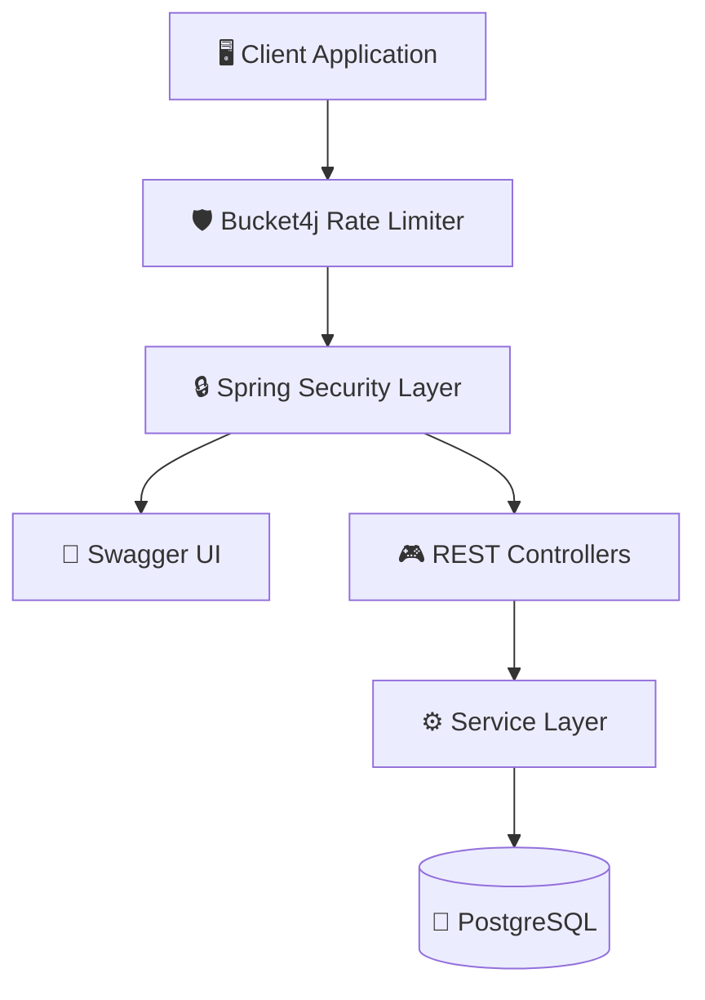

# 🔗 URL Shortener API — Production-Ready URL Management Service


Production-ready URL shortening platform built using Spring Boot 3, PostgreSQL, Spring Security 6, JWT, and Bucket4j.

Designed to provide secure multi-user URL management with custom short codes, analytics, rate limiting, and cloud deployment.

---

## 🔥 Core Features

* Stateless JWT Authentication
* Role-Based Authorization
* Custom Short URL Generation
* User-Specific URL Management
* URL Expiry Support
* Click Analytics Tracking
* API Rate Limiting using Bucket4j
* Pagination and Sorting
* Global Exception Handling
* Dockerized Deployment
* RESTful API Architecture
* Interactive API Documentation using Swagger/OpenAPI

---

## 🛠️ Tech Stack

### Backend

* Java 17
* Spring Boot 3
* Spring Security 6
* Spring Data JPA
* Hibernate ORM
* Springdoc OpenAPI / Swagger UI

### Database

* PostgreSQL (Neon PostgreSQL)
* H2 Embedded Database (Development Environment)

### Security

* JWT Authentication
* BCrypt Password Encryption

### Reliability

* Bucket4j Rate Limiting
* DTO-Based Request/Response Models
* Centralized Exception Handling

### DevOps & Deployment

* Docker
* Render Cloud Platform
* Maven

---

## ⚡ System Architecture



---

## 🔐 Authentication Flow

* Users register using secure signup endpoints.
* JWT tokens are generated after successful login.
* Custom JWT filters validate protected requests.
* Stateless session management is enforced.
* Passwords are encrypted using BCrypt.

---

## 🔗 URL Shortening Workflow

1. User authenticates using JWT.
2. User submits a long URL.
3. System generates a unique or custom short code.
4. URL metadata is persisted in PostgreSQL.
5. Short URL redirects users to the original destination.
6. Click statistics are updated for analytics.

---

## 📊 Click Analytics

Track important URL insights including:

* Total click count
* URL creation timestamp
* Expiry information
* User ownership details

### Benefits

* Monitor shortened URL usage.
* Analyze engagement trends.
* Identify frequently accessed links.

---

## 🛡️ API Rate Limiting

Implemented request throttling using Bucket4j.

### Benefits

* Prevents API abuse.
* Protects backend resources.
* Improves overall service reliability.
* Ensures fair usage among users.

---

## 🌍 Deployment

Deployed on Render using Neon PostgreSQL with:

* Environment variable management
* Cloud-hosted backend services
* Dockerized deployment consistency
* Production-ready database integration

---

## 📘 API Documentation

Swagger UI available at:

```txt
https://url-shortener-wuv4.onrender.com/swagger-ui/index.html#/
```

---

## 📡 API Endpoints

| Method | Endpoint                   | Description              |
| ------ | -------------------------- | ------------------------ |
| POST   | `/api/auth/register`       | Register User            |
| POST   | `/api/auth/login`          | Generate JWT             |
| POST   | `/api/urls`                | Create Short URL         |
| GET    | `/api/urls`                | Retrieve User URLs       |
| GET    | `/{shortCode}`             | Redirect to Original URL |
| PUT    | `/api/urls/{id}`           | Update URL               |
| DELETE | `/api/urls/{id}`           | Delete URL               |
| GET    | `/api/urls/{id}/analytics` | View Click Analytics     |
| GET    | `/swagger-ui/index.html`   | Swagger UI Documentation |

---

## 🐳 Run Using Docker

```bash
docker-compose up --build
```

---

## 🚀 Local Setup

```bash
git clone https://github.com/CHARANGANESH912/url-shortener.git

cd url-shortener

mvn spring-boot:run
```

---

## 🔮 Future Improvements

* Redis caching for frequently accessed URLs
* QR code generation for shortened links
* Custom domain support
* Email notifications for expiring URLs
* Prometheus and Grafana monitoring
* Unit and Integration Testing using JUnit and Testcontainers
* GitHub Actions CI/CD pipeline

---

## 👨‍💻 Author

**Kalevaru Charan Ganesh**
Backend-Focused Java Developer

B.Tech CSE — B. V. Raju Institute of Technology, Narsapur
